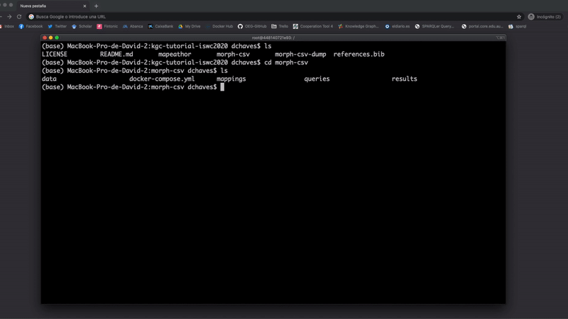

# Morph-CSV

Morph-CSV is an open source tool for querying tabular data sources using SPARQL. It exploits the information from the query, RML+FnO mappings and CSVW metadata to enhance the performance and completness of traditional OBDA systems (SPARQL-to-SQL translators). At this moment can be embebed in the top of any R2RML-compliant system. For detail information, watch the [introductory video about Morph-CSV](https://www.youtube.com/watch?v=bW9Wj7KUuGY)


## How to use it?
First of all clone the repository:
```bash
git clone https://github.com/oeg-upm/morph-csv.git
cd morph-csv
```
The best way to run Morph-CSV is using its user interface, deployable with docker*:
```bash
 docker-compose up -d
 ```
An user interface as we show in the following image will be display in localhost:5000


If you prefer a CLI tool, we provide two ways to run morph-csv: using the created docker image or directly run with Python3:
- Using docker and docker-compose*:
    ```bash
    docker-compose up -d
    docker exec -it morphcsv python3 /morphcsv/morphcsv.py -c /configs/config-file.json -q /queries/query-file.rq
    ```

   

- Using python3 (under a UNIX system):
    ```bash
    pip3 install -r requirements.txt
    python3 morphcsv.py -c path-to-config-file.json -q path-to-query-file.rq
    ```

 *If you have any local resource you want to use copy it to the corresponding shared volume (folders: data, mappings, configs or queries)

### Define your config.json file
The path of the data sources in CSVW and YARRRML anotations have to be the same.
```json
{
  "csvw":"PATH OR URL to CSVW annotations",
  "yarrrml": "PATH OR URL TO YARRRML+FnO Mapping"
}
```

## Evaluation
Morph-CSV has ben tested over three use cases: BSBM, [Madrid-GTFS-Bench](https://github.com/oeg-upm/gtfs-bench/) and Bio2RDF project. You can get the resources used and the results obtained in the branch [evaluation](https://github.com/oeg-upm/morph-csv/tree/evaluation).


## Publications:
- David Chaves-Fraga, Edna Ruckhaus, Freddy Priyatna, Maria-Esther Vidal, Oscar Corcho: Enhancing Virtual Ontology Based Access over Tabular Data with Morph-CSV. Semantic Web Journal, 2021. [Online](http://www.semantic-web-journal.net/content/enhancing-virtual-ontology-based-access-over-tabular-data-morph-csv-0)
- David Chaves-Fraga, Freddy Priyatna, Idafen Santana-Pérez and Oscar Corcho: Virtual Statistics Knowledge Graph Generation from CSV files. Emerging Topics in Semantic Technologies: ISWC2018  Satellite  Events. Vol. 36. Studies on the Semantic Web. IOS Press,2018, pp. 235–244 [Online Version](https://www.researchgate.net/publication/328118582_Virtual_Statistics_Knowledge_Graph_Generation_from_CSV_files)
- Oscar Corcho, Freddy Priyatna, David Chaves-Fraga: Towards a New Generation of Ontology Based Data Access. Semantic Web Journal, 2020. [Online version](http://www.semantic-web-journal.net/content/towards-new-generation-ontology-based-data-access)
- Ana Iglesias-Molina, David Chaves-Fraga, Freddy Priyatna, Oscar Corcho: Enhancing the Maintainability of the Bio2RDF project Using Declarative Mappings. 12th International Semantic Web Applications and Tools for Health Care and Life Sciences Conference, 2019. [Online version](https://www.researchgate.net/publication/338717453_Enhancing_the_Maintainability_of_the_Bio2RDF_Project_Using_Declarative_Mappings)
-  David Chaves-Fraga, Luis Pozo, Jhon Toledo, Edna Ruckhaus, Oscar Corcho: Morph-CSV: Virtual Knowledge Graph Access for Tabular Data. 19th International Semantic Web Conference P&D, 2020. [Online](http://ceur-ws.org/Vol-2721/paper478.pdf)

## Authors and Contact
Ontology Engineering Group - Data Integration:
- [David Chaves-Fraga](https://github.com/dachafra) ([dchaves@fi.upm.es](mailto:dchaves@fi.upm.es))
- [Jhon Toledo](https://github.com/jatoledo) ([ja.toledo@upm.es](mailto:ja.toledo@upm.es))
- [Luis Pozo](https://github.com/w0xter) ([luis.pozo@upm.es](mailto:luis.pozo@upm.es))
